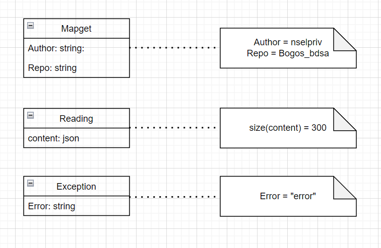

# SE Assignment for week 3

1. Illustrate the architecture of your REST service using a suitable notation

2. illustrate with an UML activity diagram the sequence of operations that your GitInsight application performs once triggered with a respective GET request and until it responds with the corresponding JSON data.

## Part one

The Architectural pattern for our distributed system is a Two-tier client-server architecture with thin clients.

Although it can be argued that our clients are not entirely thin since they implement some logic with c# in our razor pages.
  
| Operation | Input | Outputs|Exceptions|
| --- | ----------- | ------ |----------|
| Mapget | Author Repo| Lookup | ''Error''|

## Part two